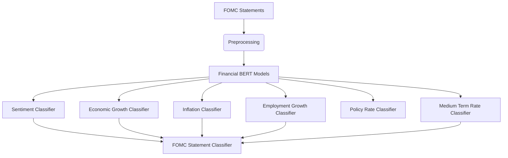

# 🏛️ FOMC Statement Classifier  

An AI-powered tool for analyzing Federal Open Market Committee (FOMC) statements, classifying sentiment and policy signals using fine-tuned financial BERT models.

## 📊 Classification Attributes

Our system analyzes FOMC statements across six key dimensions: 

(Click on the respective attribute names to check its model on Huggingface)

### 1. [Sentiment Analysis](https://huggingface.co/Vk311810/fomc_sentiment_classifier)
**Purpose:** Measures overall tone of the statement  
**Possible Classifications:**
- `Positive` - Optimistic economic outlook
- `Neutral` - Balanced/mixed language
- `Negative` - Pessimistic or cautionary tone

### 2. [Economic Growth](https://huggingface.co/Vk311810/fomc-economic_growth-classifier)
**Purpose:** Assesses projected GDP trajectory  
**Possible Classifications:**
- `Up` - Expecting economic expansion
- `Flat` - Anticipating stable growth
- `Down` - Predicting economic contraction

### 3. [Employment Growth](https://huggingface.co/Vk311810/fomc-employment_growth-classifier)
**Purpose:** Evaluates labor market expectations  
**Possible Classifications:**
- `Up` - Improving employment conditions
- `Flat` - Stable job market outlook
- `Down` - Expected employment slowdown

### 4. [Inflation Outlook](https://huggingface.co/Vk311810/fomc-inflation-classifier)
**Purpose:** Analyzes price stability projections  
**Possible Classifications:**
- `Up` - Rising inflation expectations
- `Flat` - Stable price projections
- `Down` - Disinflationary pressures

### 5. [Medium-Term Rate](https://huggingface.co/Vk311810/fomc-medium_rate-classifier)
**Purpose:** Predicts 2-5 year rate trajectory  
**Possible Classifications:**
- `Hawkish` - Tightening bias expected
- `Dovish` - Accommodative policy likely

### 6. [Policy Rate](https://huggingface.co/Vk311810/fomc-policy_rate-classifier)
**Purpose:** Forecasts near-term Fed actions  
**Possible Classifications:**
- `Raise` - Rate hike anticipated
- `Flat` - Rates expected to hold
- `Lower` - Rate cut projected

## ✨ Features

- **Historical Comparison**: Analyze statement evolution over time
- **Confidence Scoring**: Probability estimates for each classification

## 🛠️ Technical Architecture

