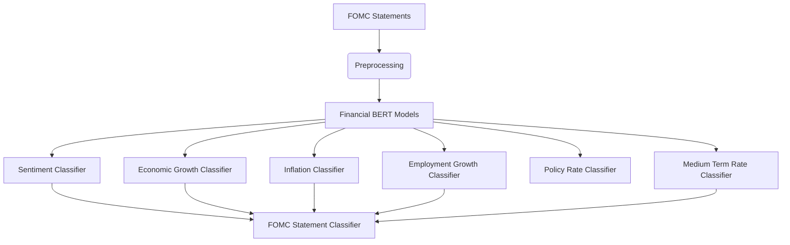

# 🏛️ FOMC Statement Classifier

An AI-powered tool for analyzing Federal Open Market Committee (FOMC) statements, classifying sentiment and policy signals using fine-tuned financial BERT models.

## ✨ Features

- **Sentiment Analysis**: Positive/Neutral/Negative classification
- **Policy Signals**: Hawkish/Dovish stance detection
- **Economic Indicators**:
  - Economic growth outlook (Up/Down/Flat)
  - Inflation projections
  - Employment trends
- **Historical Comparison**: Analyze statement evolution over time
- **Confidence Scoring**: Probability estimates for each classification

## 🛠️ Technical Architecture

